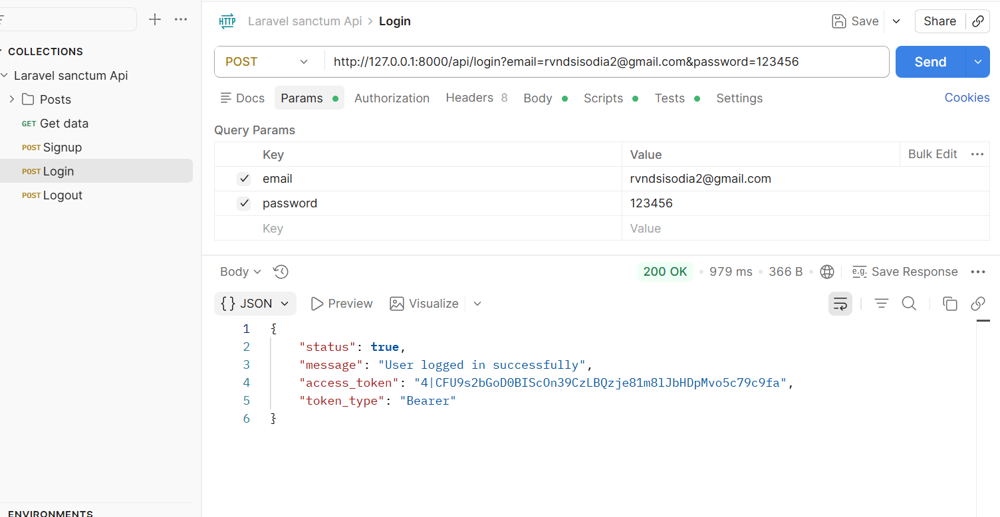
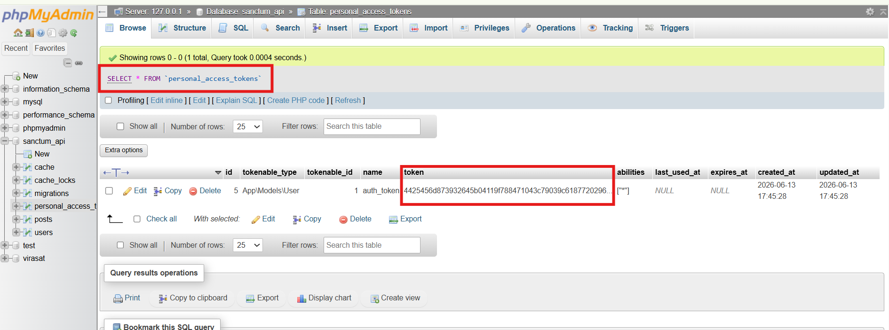
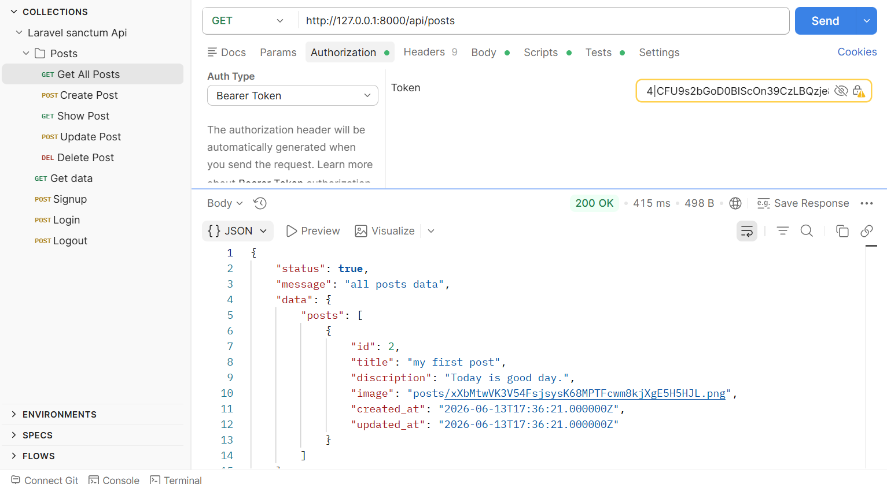
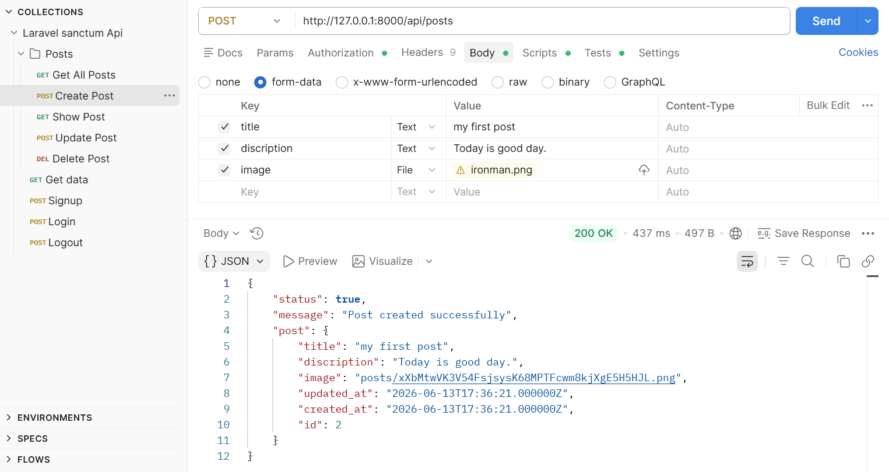
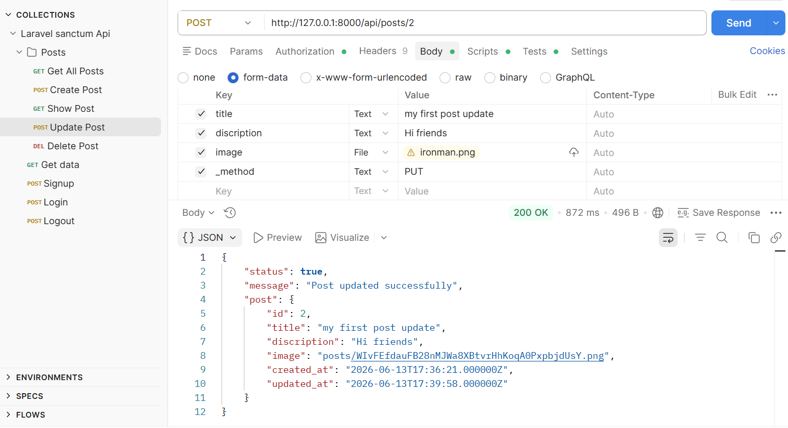
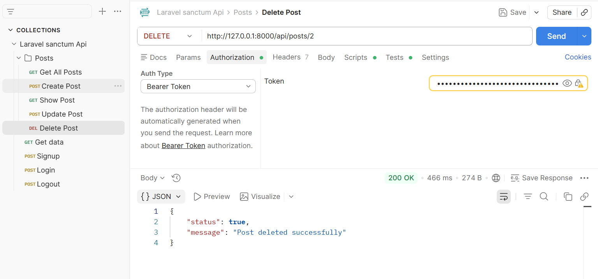
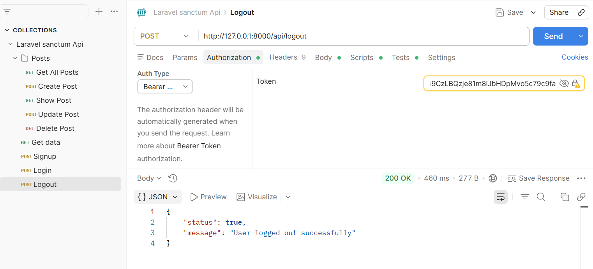
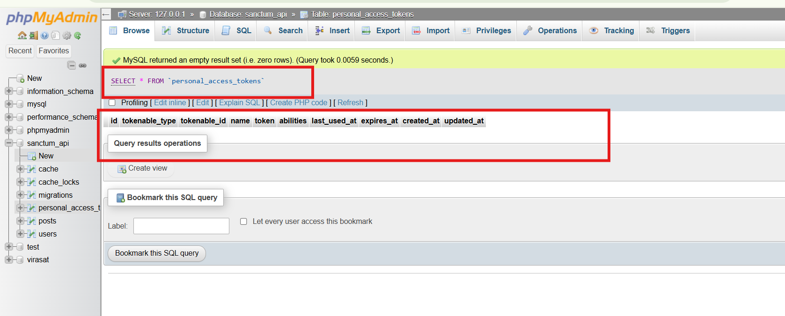

# Laravel 11 Sanctum API CRUD

A simple REST API project built with Laravel 11 and Laravel Sanctum to understand API authentication, token-based login, and CRUD operations.

The project demonstrates how to secure APIs using Sanctum, authenticate users, and perform Create, Read, Update, and Delete operations through API endpoints tested using Postman.

---

## Project Purpose

The main objective of this project was to learn:

- Laravel Sanctum Authentication
- API Token Generation
- Protected Routes
- REST API Development
- API Testing with Postman
- File Upload via API
- CRUD Operations using APIs

---

## Features

### Authentication

- User Login API
- User Logout API
- Sanctum Token Authentication
- Protected API Routes

### Post CRUD APIs

- Create Post
- View All Posts
- View Single Post
- Update Post
- Delete Post
- Image Upload Support

---

## Technology Stack

| Technology      | Purpose              |
| --------------- | -------------------- |
| Laravel 11      | Backend Framework    |
| PHP 8.x         | Server-side Language |
| MySQL           | Database             |
| Laravel Sanctum | API Authentication   |
| Postman         | API Testing          |

---

## API Endpoints

### Authentication APIs

#### Login

POST /api/login

Parameters:

- email
- password

Returns:

- Access Token
- User Information

---

#### Logout

POST /api/logout

Requires:

Authorization Bearer Token

---

### Post APIs

#### Get All Posts

GET /api/posts

---

#### Create Post

POST /api/posts

Parameters:

- title
- description
- image

---

#### Get Single Post

GET /api/posts/{id}

Example:

GET /api/posts/1

---

#### Update Post

PUT /api/posts/{id}

Parameters:

- title
- description
- image

Example:

PUT /api/posts/1

---

#### Delete Post

DELETE /api/posts/{id}

Example:

DELETE /api/posts/1

---

## Sanctum Authentication Flow

1. User logs in using email and password.
2. Laravel Sanctum generates an API token.
3. Token is returned in the response.
4. Client sends the token in the Authorization header.
5. Protected APIs validate the token before processing requests.
6. Logout revokes the token.

---

## Database Setup

Configure your database credentials in the `.env` file
Run migrations: php artisan migrate

---

## Screenshots

### Login API (Postman)

### When Login API - Create token in DB Table (personal_access_tokens)

### Get Posts API

### Create Post API

### Update Post API

### Delete Post API

### Logout API

### When Logout API - Remove token in DB Table (personal_access_tokens)

---

## Installation

Clone repository:

git clone https://github.com/your-username/laravel11-sanctum-api-crud.git

Install dependencies:

composer install

Create environment file:

cp .env.example .env

Generate application key:

php artisan key:generate

Run migrations:

php artisan migrate

Start server:

php artisan serve

---

## Learning Outcomes

Through this project, I gained hands-on experience with:

- Laravel Sanctum
- Token-Based Authentication
- API Security
- RESTful API Development
- Postman Testing
- File Upload APIs
- Laravel 11 API Development

---

## Author

Arvind Singh Sisodia
Date: 05-04-2026

Sr.PHP Developer | Sr.Laravel Developer
